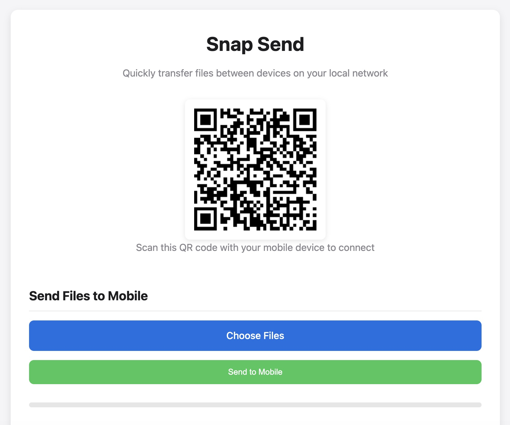
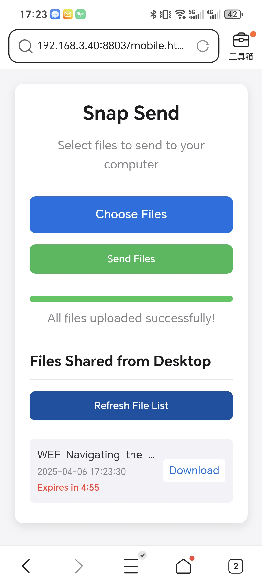

# Snap Send

A simple tool for transferring files between mobile and desktop on the same local network.

## Features
- No need mobile apps.
- Local network file transfer without internet connection
- Files expire after 5 minutes with countdown timer
- Two-way file and text transfers (mobile ↔ desktop)

<div align="center">
  
  <p><em>Desktop view with QR code for mobile connection</em></p>

  
  <p><em>Mobile view of Snap Send</em></p>
</div>

## Quick Start

1. Make sure you have Python 3 installed on your computer
2. Clone this repository or download the files
3. Open a terminal in the project directory
4. Run the server:

```bash
python3 snap_send_server.py
```

5. A browser window will automatically open with the desktop interface
6. Scan the QR code with your mobile device
7. Start transferring files and text between devices

## System-wide Installation

For convenience, you can install Snap Send system-wide to run it from anywhere:

```bash
chmod +x scripts/install_snap_send.sh
./scripts/install_snap_send.sh
```

After installation, simply type `snap_send` in any terminal to launch the service.


## Troubleshooting

- **Can't connect from mobile**: Make sure both devices are on the same network
- **QR code not scanning**: Try entering the URL manually on your mobile device
- **Files not transferring**: Check for firewall restrictions on your computer
- **Large files**: Files over 10MB are not supported in this version, but can be set up

## Limitations

This is a simple implementation for local network transfers. For security reasons:

- No encryption is used (don't transfer sensitive data)
- Transfers work only on the same local network
- There's no authentication mechanism
- All files are automatically deleted after 5 minutes

## License

MIT 
